# LED board

A wall of **584 addressable pixels** — eight identical segments of 73 — that
fills with light one pixel at a time, then breathes. A Seeed XIAO ESP32C3 on a
custom 24 V driver board runs all eight segments from a single hardware timer,
and raises its own Wi-Fi access point so colour, timing and power budget can be
changed from a phone with no app and no internet.

<p align="center">
  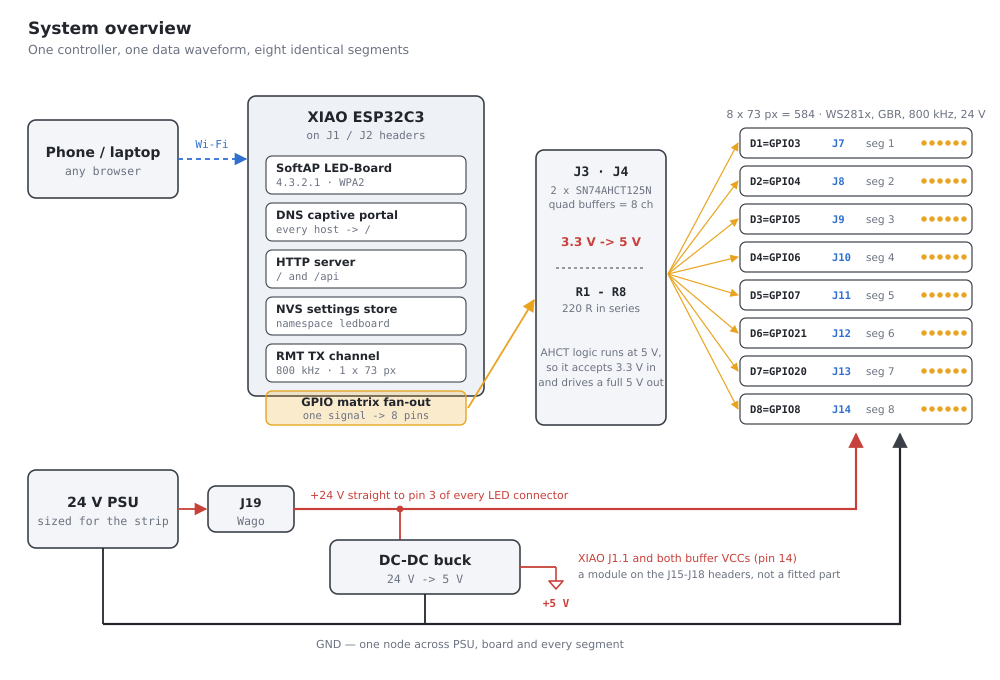
</p>

| | |
|---|---|
| Controller | Seeed Studio XIAO ESP32C3 on the `otherworlds-v2` driver board |
| Output | 8 segments × 73 px = **584** WS281x, colour order GBR, 800 kHz, 24 V |
| Frame rate | **63 fps** with the access point running |
| Control | Wi-Fi AP `LED-Board` / `ledboard` → <http://4.3.2.1/> |
| Persistence | All settings in NVS, survive a power cycle |

---

## Contents

- [How it behaves](#how-it-behaves)
- [Web UI](#web-ui)
- [HTTP API](#http-api)
- [Driving 8 outputs from a 2-channel chip](#driving-8-outputs-from-a-2-channel-chip)
- [The driver board](#the-driver-board)
- [Firmware hardware map](#firmware-hardware-map)
- [Power](#power)
- [Build, flash, monitor](#build-flash-monitor)
- [Repository layout](#repository-layout)
- [Status](#status)

---

## How it behaves

Power-up runs a two-stage sequence, identical and in step across all eight
segments:

1. **FILL** — the segment fades up pixel by pixel from the first to the last,
   with a soft leading edge spanning a settable number of pixels.
2. **BREATHE** — once full, brightness cycles between 100% and a settable floor,
   forever.

Turning the lights off runs the fill **backwards**: the pixels withdraw in
exactly the reverse order they arrived, so the last to light is the first to go
dark. Pressing off mid-sweep picks up at the matching front position rather than
snapping, so it stays smooth even if you change your mind halfway.

<p align="center">
  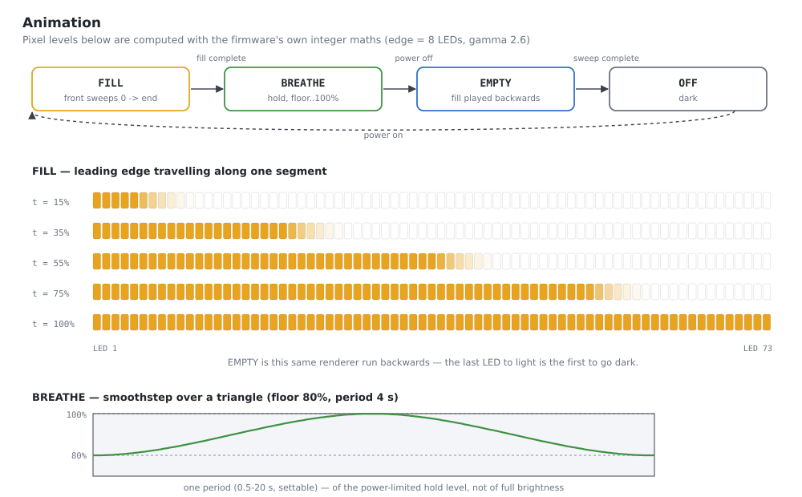
</p>

<p align="center">
  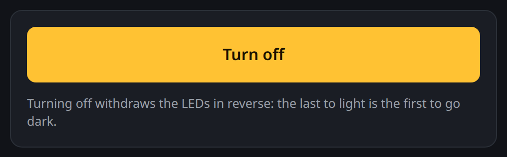
  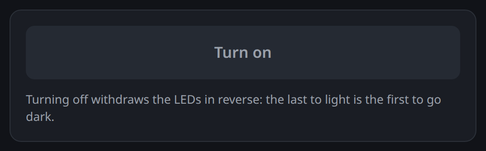
</p>

The pixel levels in that diagram are not an illustration — they are computed by
running the firmware's own integer maths (`renderFrontAt()`, `breatheWave()` and
NeoPixel's gamma-2.6 table) outside the chip. The fade is gamma-corrected so it
ramps evenly to the eye instead of spending most of its apparent brightness in
the first few percent.

## Web UI

The board raises its own access point with a captive portal. Join the network
and the "sign in to network" sheet should open the UI by itself; if not, browse
to the address.

| | |
|---|---|
| SSID | `LED-Board` |
| Password | `ledboard` |
| Address | <http://4.3.2.1/> |

Everything on the page is inline — no CDN is reachable on an access point — so
the colour wheel is drawn on a `<canvas>` rather than pulled from a library.

<p align="center">
  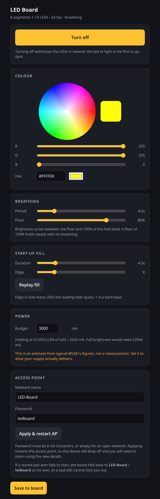
  &nbsp;&nbsp;
  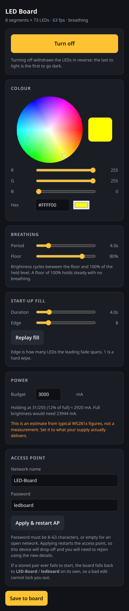
</p>

<sub>Left: the page as served, at its 520 px maximum width. Right: the same page
at 390 px — it is a single responsive column, which is how it will actually be
used.</sub>

### Colour

An HSV wheel (drag to pick), R/G/B sliders, a hex field, and the OS-native
colour picker. All four stay in sync, and changes are pushed to the strip live,
debounced at ~60 ms.

<p align="center">
  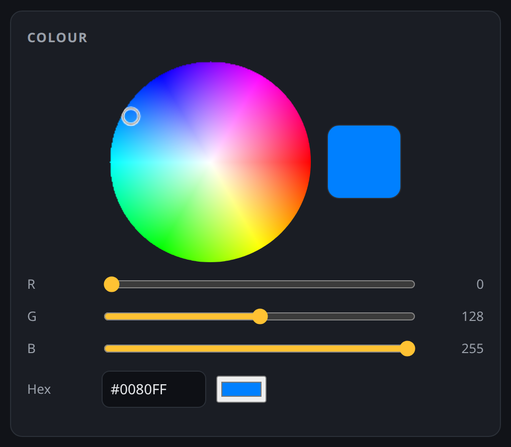
</p>

### Breathing and start-up fill

<p align="center">
  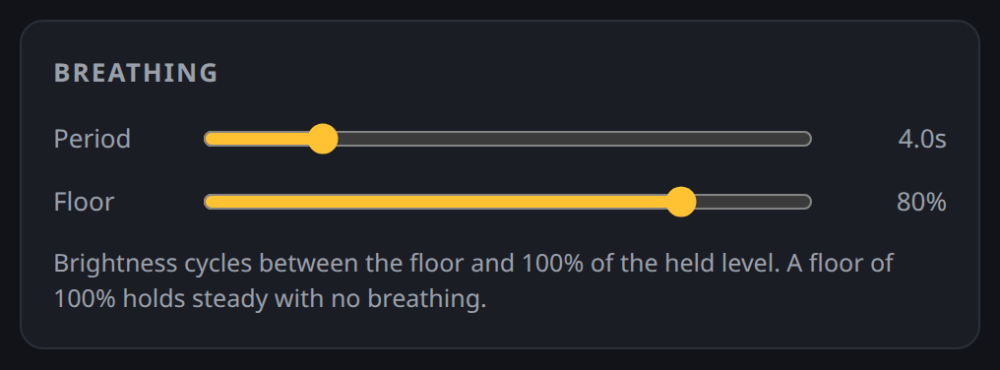
</p>

<p align="center">
  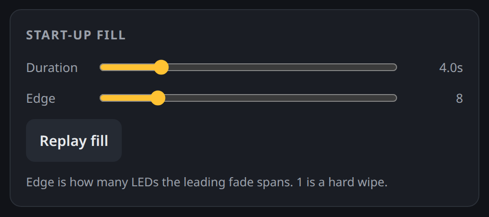
</p>

Period runs 0.5–20 s; a floor of 100% holds steady with no breathing. *Replay
fill* restarts the fill animation so it can be watched again without a reboot.
Edge is how many pixels the leading fade spans — 1 is a hard wipe.

### Power

The budget, with live feedback on the resulting hold level and estimated draw.
The limiter accounts for the *current colour*: red lights one channel, yellow
two, white three, so the achievable brightness changes as you pick. Read
[Power](#power) before trusting the milliamp figure on this 24 V board.

<p align="center">
  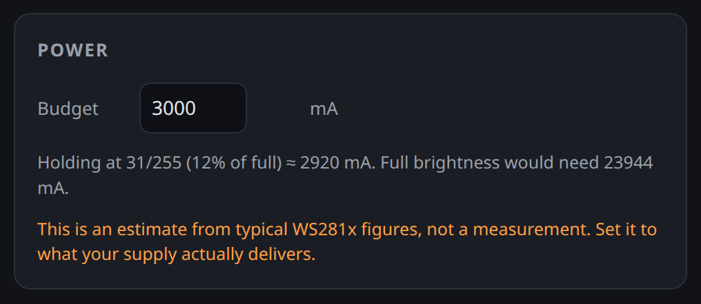
  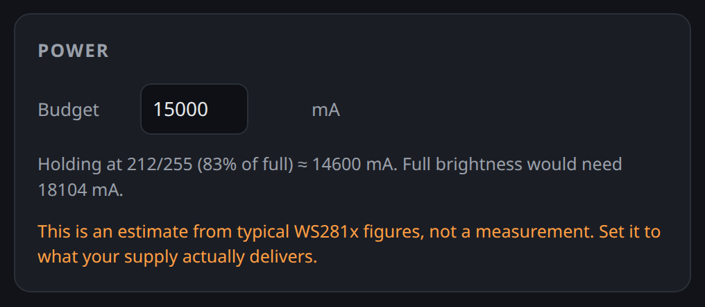
</p>

<sub>The same card at a 3000 budget (left) and 15000 with a blue-ish colour
selected (right). Both numbers come from the firmware's own estimator.</sub>

### Access point — you cannot lock yourself out

<p align="center">
  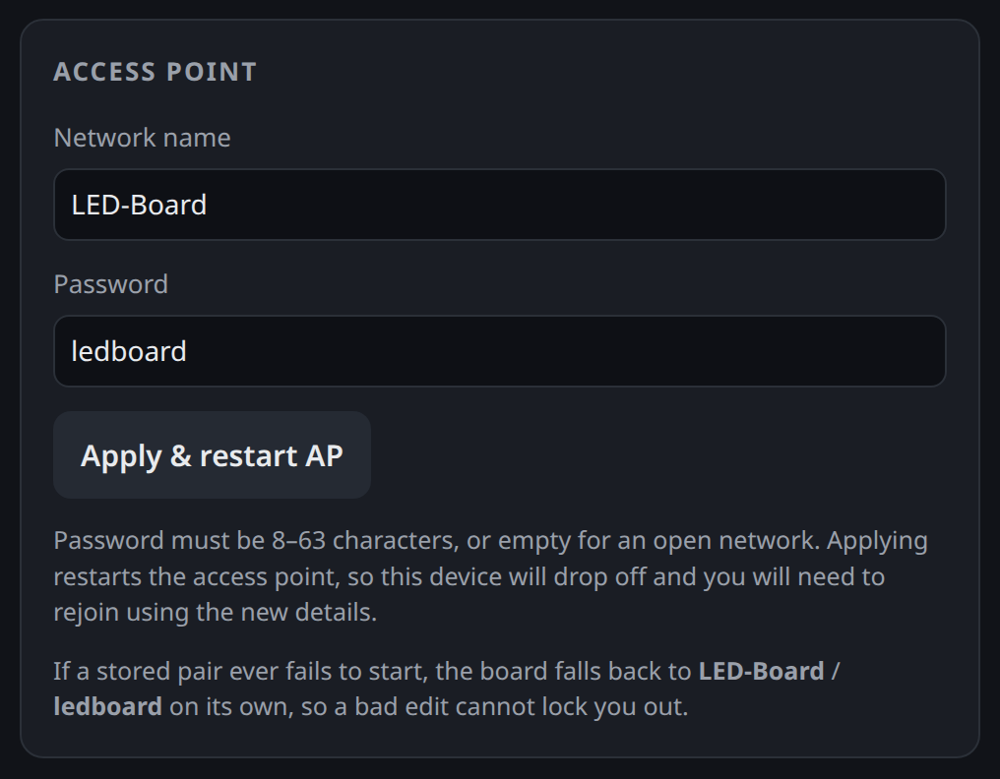
</p>

Credentials are validated server-side before being stored: SSID 1–32 characters,
password empty for an open network or 8–63 characters. A 1–7 character password
is rejected, since no access point will start with one. On top of that, if a
stored pair ever fails to bring the AP up, the board falls back to `LED-Board` /
`ledboard` by itself. **Recovering never requires reflashing over USB.**

Applying restarts the radio, so the phone will drop off and must rejoin with the
new details. The HTTP reply is sent ~400 ms before the restart, so the browser
always sees the response.

### Saving

Changes apply live. **Save to board** writes them to NVS so they survive a power
cycle; without saving, the board reverts to its defaults on reboot — including
the on/off state, so a board saved "off" comes back off.

## HTTP API

Handy for scripting or an external controller. All values are clamped
server-side, so out-of-range input is safe.

| Endpoint | Purpose |
|---|---|
| `GET /api/state` | Current settings, hold level, estimated mA, fps, phase |
| `GET /api/set?r=&g=&b=&bp=&bm=&fd=&fe=&pb=` | Set any subset; returns the new state |
| `GET /api/power?on=0\|1` | Turn off (reverse withdraw) or on (fill) |
| `GET /api/ap?ssid=&pass=` | Change AP credentials; `400` if invalid |
| `GET /api/fill` | Restart the fill animation |
| `GET /api/save` | Persist current settings to NVS |

Parameters: `r` `g` `b` 0–255 · `bp` breathe period ms 200–120000 · `bm` breathe
floor % 0–100 · `fd` fill duration ms 100–120000 · `fe` fill edge px 1–73 ·
`pb` power budget 100–40000.

`phase` reports `filling`, `breathing`, `emptying` or `off`.

```console
$ curl "http://4.3.2.1/api/state"
{"on":true,"ssid":"LED-Board","pass":"ledboard","r":255,"g":255,"b":0,
 "bp":4000,"bm":80,"fd":4000,"fe":8,"pb":3000,"hold":31,"ma":2920,
 "maFull":23944,"fps":63,"phase":"breathing"}
```

Wi-Fi does not disturb the LED output — the strips are driven by the RMT
peripheral in hardware, and the frame rate stayed at 62–63 fps with the AP up
and a client connected.

## Driving 8 outputs from a 2-channel chip

The ESP32-C3 has only **2 RMT TX channels**, which rules out both obvious
approaches. The firmware instead transmits **one** segment's worth of data on a
single RMT channel bound to GPIO3, then uses the GPIO matrix
(`esp_rom_gpio_connect_out_signal`) to route that same output signal to the
other seven pins. Every segment gets an identical, hardware-timed waveform, and
a frame costs one transmission (~2.2 ms) instead of eight.

<p align="center">
  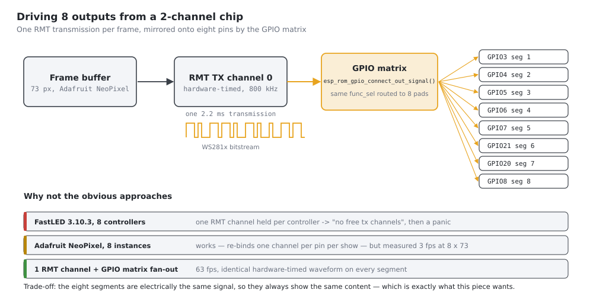
</p>

**The trade-off:** all 8 segments necessarily show the *same* content. That is
exactly what this piece wants. If independent per-segment animation is ever
needed, the options are:

- **2 independent strips** via FastLED (the chip's real RMT limit), or
- **8 independent strips** via a parallel bit-bang driver, computing an 8-bit
  GPIO mask per bit period — all eight pins live in one 32-bit output register,
  so this is feasible but needs cycle-accurate timing work, or
- **a chip with more RMT channels** — ESP32-S3 has 4, the original ESP32 has 8.

## The driver board

KiCad project: [`electronics/otherworlds-v2.kicad_pro`](electronics/otherworlds-v2.kicad_pro).
Two-layer, **98.7 × 90.9 mm**, 1.6 mm, four M4 mounting holes, through-hole
throughout so it can be built by hand.

<p align="center">
  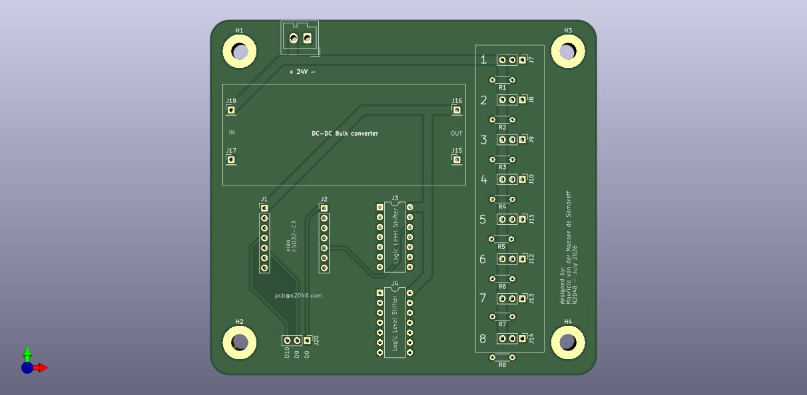
</p>

<p align="center">
  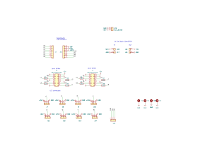
</p>

<sub>Exported from
<a href="electronics/otherworlds-v2.kicad_sch">otherworlds-v2.kicad_sch</a> with
<code>kicad-cli</code>. Also available as
<a href="images/schematic/otherworlds-v2.pdf">PDF</a>, and the layers as
<a href="images/schematic/pcb-front.svg">front</a> /
<a href="images/schematic/pcb-back.svg">back</a> SVG.</sub>

### Signal path

<p align="center">
  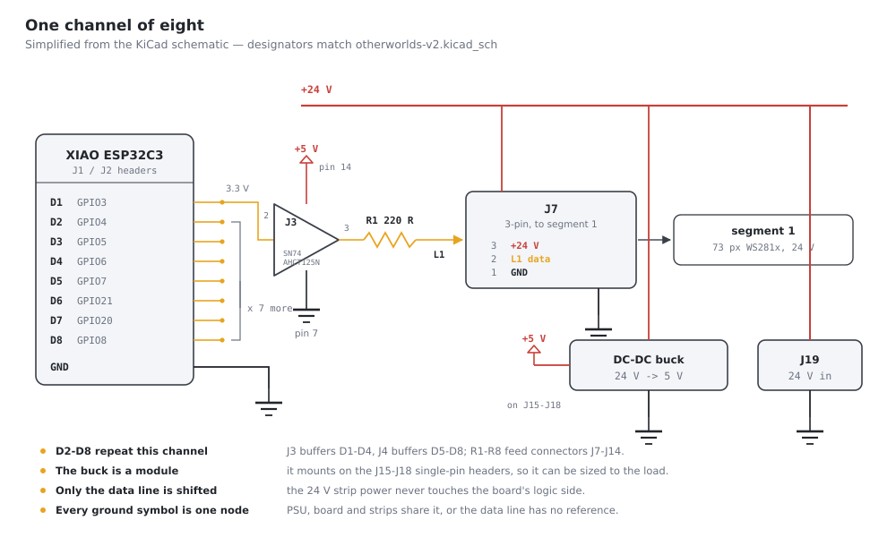
</p>

Each of the eight channels is the same four parts:

**XIAO Dn → SN74AHCT125N buffer → 220 Ω → LED connector pin 2.**

The buffers run from the on-board 5 V rail. AHCT-family logic takes a 3.3 V
input as a valid high and drives a full 5 V output, which is what gets the data
line clear of a WS281x input threshold — the XIAO's own 3.3 V swing is marginal
and fails intermittently on a long lead.

Only the data line passes through the board's logic side; **+24 V goes straight
from the Wago input to pin 3 of every LED connector** and never touches it.

### Bill of materials

From [`electronics/production/bom.csv`](electronics/production/bom.csv):

| Ref | Part | Qty | Footprint |
|---|---|---|---|
| J3, J4 | SN74AHCT125N quad buffer | 2 | DIP-14, 7.62 mm |
| R1–R8 | 220 Ω | 8 | Axial DIN0204, 5.08 mm |
| J1, J2 | 1×7 pin header — the XIAO | 2 | 2.54 mm vertical |
| J7–J14 | 1×3 pin header — LED segments 1–8 | 8 | 2.54 mm vertical |
| J15–J18 | 1×1 pin header — buck converter module | 4 | 2.54 mm vertical |
| J19 | Wago 734-132 — 24 V input | 1 | 3.50 mm vertical |
| J20 | 1×3 pin header — D0/D9/D10 breakout | 1 | 2.54 mm vertical |
| H1–H4 | M4 mounting hole, plated | 4 | 4.3 mm |

The DC-DC buck converter is a **module**, not a fitted part: it sits on the four
single-pin headers (`J18`/`J17` in, `J16`/`J15` out), so it can be sized to the
5 V load and swapped without touching the board.

`J20` breaks out D0, D9 and D10 — the three pins the LED channels do not use.
D0/GPIO2 and D9/GPIO9 are strapping pins; read
[the pinout notes](firmware/docs/xiao-esp32c3-pinout.md) before hanging anything
off them.

### Connector map

Traced through the netlist exported from the committed schematic — not read off
the drawing:

| Connector (silkscreen) | J7 (1) | J8 (2) | J9 (3) | J10 (4) | J11 (5) | J12 (6) | J13 (7) | J14 (8) |
|---|---|---|---|---|---|---|---|---|
| Net | L1 | L2 | L3 | L4 | L5 | L6 | L7 | L8 |
| Resistor | R1 | R2 | R3 | R4 | R5 | R6 | R7 | R8 |
| Buffer | J3 | J3 | J3 | J3 | J4 | J4 | J4 | J4 |
| XIAO pin | D1 | D2 | **D4** | **D3** | D5 | D6 | **D8** | **D7** |
| GPIO | 3 | 4 | 6 | 5 | 7 | 21 | 8 | 20 |

Note the two crossed pairs: J9/J10 are fed by D4/D3, and J13/J14 by D8/D7. That
is harmless here — every output carries the identical waveform, so which pin
lands on which connector cannot change what the wall does — but it is worth
knowing before probing a channel with a scope.

Every LED connector is wired the same way: **pin 1 = GND, pin 2 = data,
pin 3 = +24 V**.

> ⚠️ **The working copy of the schematic is mid-edit and currently inconsistent.**
> In `HEAD` every data label appears exactly twice (once at the XIAO header,
> once at a buffer input). In the uncommitted file, `D1` and `D2` appear only
> once each while `D7` and `D8` appear three times — the two labels at J3's
> first inputs now read D7/D8, so those buffers would be driven in parallel with
> J4's and D1/D2 would drive nothing. Because all eight channels carry the same
> waveform, the piece would still *look* correct, which is what makes it worth
> catching. The table above comes from `HEAD`; re-run
> `bash scripts-tools/export-kicad.sh` and re-check it once the edits land.

## Firmware hardware map

| | |
|---|---|
| Board | Seeed Studio XIAO ESP32C3 (`seeed_xiao_esp32c3`) |
| MCU | ESP32-C3, single-core RISC-V @ 160 MHz, 4 MB flash |
| Platform | pioarduino `espressif32` 54.3.20 — Arduino core 3.2.0, ESP-IDF 5.4 |
| LED library | Adafruit NeoPixel 1.15.5 (FastLED 3.10.3 kept for colour helpers) |
| Strip | WS281x, 800 kHz, colour order **GBR**, 24 V |
| Segments | 8 × 73 px = 584 total |
| Data pins | D1–D8 = GPIO 3, 4, 5, 6, 7, 21, 20, 8 |
| Serial | Native USB Serial/JTAG, 115200 baud |

Strip parameters (WS281x / GBR / 73) were taken from a WLED configuration
confirmed working on this exact hardware — worth keeping as the reference if
anything ever regresses. `73` counts **control ICs**, not LED packages: a 24 V
strip usually groups several physical LEDs behind each addressable pixel.

D1/GPIO3 carries the master signal because it is **not** a strapping pin, so an
attached strip cannot interfere with boot the way D0/D8/D9 could.

> **There is no GPIO22 on the ESP32-C3** — its GPIO range is 0–21. D7 is
> **GPIO20** (UART0 RX), which is what the seventh segment uses.

Full pin map, strapping-pin traps and the BOOT-button recovery procedure:
[firmware/docs/xiao-esp32c3-pinout.md](firmware/docs/xiao-esp32c3-pinout.md).

## Power

Adafruit NeoPixel has no power management of its own, so the firmware includes a
limiter: it finds the brightest scaling of the chosen colour that fits
`powerBudgetMa` and holds there, which is why the UI reports a *hold level*
rather than simply obeying the brightness you asked for.

### The estimator models a 5 V strip

> ⚠️ **The milliamp figures the firmware reports are a 5 V-strip model** —
> 20 mA per channel per pixel at full, plus 1 mA idle per controller IC. **This
> board runs the strips at 24 V**, where the current drawn from the supply is a
> different number entirely (roughly the strip's rated W/m × length ÷ 24 V).
>
> So on this hardware, treat the budget as **a brightness cap in the firmware's
> own units**, not as amps at the PSU. Size the actual supply from the strip's
> rating, measure the real draw, and then pick the budget that lands on a
> brightness you can afford.

What the limiter does with a given budget, for yellow (255, 255, 0) across all
584 pixels — these are the numbers the UI will show:

| Budget | Hold level | Fraction of full | Reported draw |
|---|---|---|---|
| 3000 (default) | 31/255 | 12% | 2920 |
| 5000 | 50/255 | 20% | 4672 |
| 10000 | 108/255 | 42% | 9928 |
| 15000 | 159/255 | 62% | 14600 |
| 20000 | 216/255 | 85% | 19856 |
| 24000+ | 255/255 | 100% | 23944 |

Colour changes the arithmetic completely. At full brightness the estimator
reports roughly **12264** for a single-channel colour (red, green, blue),
**23944** for a two-channel one (yellow, cyan, magenta) and **35624** for white
— so the same budget buys a much brighter red than white.

Whatever the voltage, two things still hold: **inject power at both ends of each
segment** (and mid-run on long ones), and expect a visible colour shift toward
red wherever the supply sags.

## Build, flash, monitor

```bash
cd firmware
pio run                    # build
pio run -t upload          # build + flash
pio device monitor         # 115200 baud
```

Last verified build (2026-08-15, `pio run`):

```
RAM:   [=         ]  11.6% (used 37944 bytes from 327680 bytes)
Flash: [========  ]  77.6% (used 1017378 bytes from 1310720 bytes)
========================= [SUCCESS] Took 12.66 seconds =========================
```

### Testing without a strip

The firmware self-reports over serial, so it can be validated with nothing
attached — the RMT peripheral will happily clock data into thin air, and the
per-2-second heartbeat reports phase, level, frame rate, estimated draw and the
number of connected Wi-Fi clients.

```
XIAO ESP32C3 - LED board
8 segments x 73 LEDs = 584 total | WS281x 800 kHz, order GBR
Pins: D1=GPIO3 D2=GPIO4 D3=GPIO5 D4=GPIO6 D5=GPIO7 D6=GPIO21 D7=GPIO20 D8=GPIO8
  RMT signal 87 on GPIO3 -> mirrored to: GPIO4 GPIO5 GPIO6 GPIO7 GPIO21 GPIO20 GPIO8
Colour 255,255,0 | budget 3000 mA -> hold 31/255 (est. 2920 mA, full 23944 mA)
AP "LED-Board" up -> http://4.3.2.1/  (password: ledboard)
PHASE: FILL
[    2000 ms] FILL    | level  31/255 | 62 fps | est. 2920 mA | clients 0
PHASE: BREATHE
[    4000 ms] BREATHE | level  27/255 | 63 fps | est. 2607 mA | clients 1
```

<sub>Format derived from the <code>Serial.printf</code> calls in
<code>main.cpp</code>; the RMT signal number is whatever the driver was
assigned. Not yet captured from hardware — see <a href="#status">Status</a>.</sub>

Three things to check first if something looks wrong:

- **Garbled colours or flicker** → wrong chipset timing. `PIXEL_TYPE` is
  `NEO_GBR + NEO_KHZ800`.
- **Colours swapped** (yellow shows as something else) → wrong byte order. Swap
  the letters in the `NEO_GBR` half of `PIXEL_TYPE`; common variants are `GRB`,
  `RGB` and `BRG`.
- **`FAN-OUT FAILED: GPIO3 has no peripheral signal`** → the RMT channel never
  bound to the master pin, so only segment 1 would light. Everything downstream
  depends on that line succeeding.

## Repository layout

```
electronics/          KiCad project "otherworlds-v2" — schematic, PCB, production files
  production/         Gerbers, BOM, positions (JLCPCB fabrication toolkit output)
firmware/             PlatformIO project
  src/main.cpp        the whole firmware: animation, power limiter, AP, web UI
  docs/               pinout and GPIO caveats
images/
  diagrams/           SVG diagrams (generated)
  schematic/          KiCad exports + the 3D render
  webui/              web UI screenshots (generated)
scripts-tools/        the generators for everything in images/
```

### Regenerating the documentation assets

All three generators are deterministic; only the KiCad exports need KiCad
installed, and none of them need hardware:

```bash
python3 scripts-tools/mkshots.py      # -> images/webui/*.png
python3 scripts-tools/mkdiagrams.py   # -> images/diagrams/*.svg
bash    scripts-tools/export-kicad.sh # -> images/schematic/*
```

`mkshots.py` lifts the page straight out of the `R"HTML(...)HTML"` literal in
`firmware/src/main.cpp`, replaces `window.fetch` with a shim that reimplements
the `/api/*` handlers — including the integer power maths — and screenshots the
result in headless Chrome. So the screenshots track the firmware: change the UI,
re-run, and the README is current. `mkdiagrams.py` likewise computes the
animation diagram from the firmware's own rendering maths. Details in
[scripts-tools/README.md](scripts-tools/README.md).

## Status

| Step | Status |
|---|---|
| PCB designed, fabrication files exported | ✅ `otherworlds-v2`, July 2026 |
| Builds for `seeed_xiao_esp32c3` | ✅ 2026-08-15 — RAM 11.6%, flash 77.6% |
| Web UI rendered and exercised | ✅ against a faithful mock of the device API |
| Flashed and run on hardware | ⏳ pending — no board on USB at time of writing |
| Board brought up with strips attached | ⏳ pending |
| Measured current draw | ⏳ pending — all power figures are estimates, and the estimator assumes 5 V |
